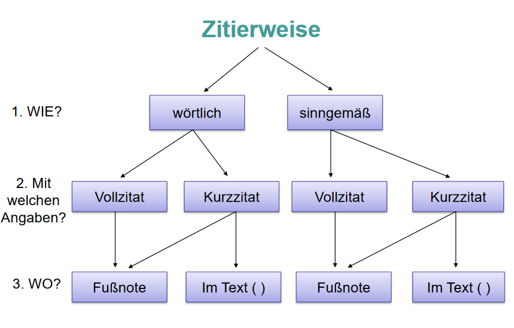

# Zitieren
jeder in der eigenen Arbeit verwendete Gedanke aus anderen Quellen ist zu zitieren. Es muss ersichtlich sein, was an fremdem Eigentum, aus welcher Quelle, in welchem Umfang und in welcher Form (wörtlich, sinngemäß) übernommen wurde. Die Kenn-zeichnung eines Zitats muss unmittelbar am Ende des Zitats erfolgen. Spätestens am Ende eines Absatzes soll das Zitat referenziertwerden, auch wenn es imunmittelbar danach  folgenden  Absatz  fortgeführt  wird.  Ein  Zitat  soll  immer  im  Kontext  einer eigenständig erarbeiteten Argumentation erfolgen
# Direktes / wörtliches Zitat
Beim wörtlichen Zitat wird ein Gedanke wörtlich –einschließlich aller Zeichen und Fehler –wiedergegeben. Für das wörtliche Zitieren gelten zudem folgende allgemei-ne Regeln:Wörtliche Zitate sollten so kurz wie möglich sein.Aneinanderreihen von wörtlichen Zitaten ist zu vermeiden. Das wörtliche Zitat wird in Anführungszeichen gesetzt. Anschließend muss die Quel-le angegeben werden.
# Indirektes / sinngemäßes Zitat
Das sinngemäße Zitat stellt den Regelfall dar. Beim sinngemäßen Zitat wird ein Ge-danke in eigenen Worten unter Verwendung der Fachsprache ausgedrückt. Im Unter-schied  zum  sinngemäßen  Zitat  stellt  das  wörtliche  Zitat  die  Ausnahme  dar.  In  fol-genden Fällen kann wörtlich zitiert werden,wenn der betreffende Zusammenhang nicht besser –und vor allem nicht kürzer –wiedergegeben werden kann;wenn Zusammenhänge analysiert und interpretiert werden müssen, z.B. bei kriti-schen Äußerungen;bei ausländischer Literatur als Ergänzung zum sinngemäßen Zitat (Übersetzung);bei anerkannten Begriffsbestimmungen und Lehrmeinungen;

## Fremdsprachig

Bei  fremdsprachigen  Texten  ist  darauf  zu  achten,  dass  Zitate  die  Lesbarkeit  beein-flussen können. Es ist davon auszugehen, dass der Leser die englische Sprache, aber nicht  die  französische,  schwedische,  japanische,  russische  oder  andere  Sprache  be-herrscht. Sobald derartige Quellen verwendet werden, ist eine Übersetzung anzustre-ben. Damit wird allerdings das wörtliche Zitieren aufgegeben. Es ist angebracht, den fremdsprachigen Text sinngemäß zu übersetzen und das wörtliche Zitat in der Origi-nalsprache in einer Fußnote einzufügen, damit der Leser die Richtigkeit der Überset-zung überprüfen kann.